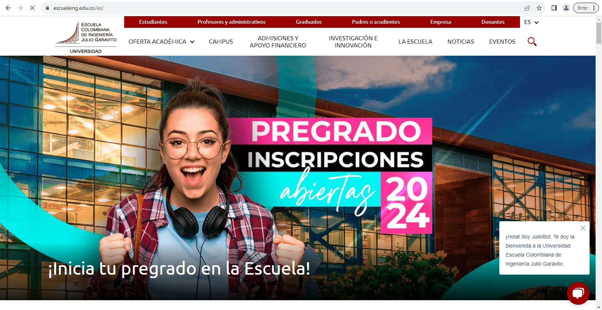
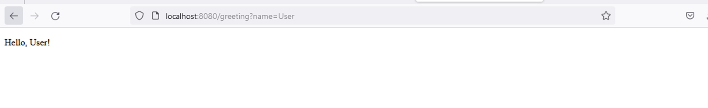

# PARTE I. - JUGANDO A SER UN CLIENTE HTTP
Abre la aplicación Postman, lo usaremos para hacer una solicitud a un servidor HTTP, al abrirlo indentifica qué controles de Postman corresponde a los elementos de entrada y salida de un servicio HTTP:

- Elementos de entrada:
    - Métodos:  
      

    - URL:
      

    - Headers:
      

    - Body:
      

    - Cookies:
      

- Elementos de salida:
    - Body: 

    - Headers: 

    - Cookies: 

Ahora has otro request GET al recurso https://dummyjson.com/todos, nuevamente verifica el body en varias opciones.

- Pretty:  
  
- Raw:  
  
- Preview:  
  

Responde las siguientes preguntas:
- ¿Qué pasa si no envío el método correcto?  
  Si no envío el método correcto, me puede sale un mensaje indicando que no podemos hacer determinado método (diferente a GET), ya que no tenemos la autorización para usar esos métodos.
  
  
- ¿Qué pasa si al body response HTML lo fuerzo a leerse como JSON?  
  Si bien es posible que a simple vista se puede leer el contenido HTML como si fuera JSON en Postman, esto no significa que se esté interpretando correctamente. Postman intenta analizar el contenido según el tipo de contenido especificado en la cabecera Content-Type, aunque siga diciendo que es HTML.

  Postman muestra el contenido HTML como si fuera JSON, esto podría deberse a que el contenido HTML tiene alguna estructura que se asemeja a JSON, pero esto no garantiza que se pueda leer o manipular correctamente como un objeto JSON.
  
- ¿Por qué el preview de HTML no se ve igual a cuando accedo a la URL en un navegador web?  
  El preview de HTML en Postman puede no verse igual que en un navegador web por varias razones:

    1. Estilos CSS no aplicados: El preview en Postman puede no aplicar los estilos CSS correctamente, lo que puede hacer que la apariencia sea diferente.

    2. Interpretación de JavaScript: Postman no interpreta ni ejecuta JavaScript en el HTML, por lo que cualquier contenido generado dinámicamente por JavaScript no se mostrará en el preview.

    3. Compatibilidad con HTML y CSS: Postman puede no ser tan compatible con ciertas características de HTML y CSS como lo es un navegador web, lo que puede llevar a diferencias en la visualización.

    4. Problemas de codificación: Si el HTML utiliza una codificación específica que no se maneja correctamente en Postman, podría afectar la visualización.

  Postman  
  
  Navegador Web
  
- ¿Qué pasa si le envías un body a una solicitud GET?  
  Si no pongo nada en la URL pero si en el Body, no me deja mandar la solicitud.  
  Si pongo el Body en el campo de la URL, no se puede mandar porque claramente no es una URL.  
  Si pongo una URL que no corresponde al Body, aborta.  
  Si pongo la URL que es con su Body correspondiente, se hace una consulta normal.

Como parte del laboratorio en casa has los dos request anteriores pero ahora usando la herramienta Telnet, ya que esta no funciona adecuadamente en los equipos del laboratorio.

# PARTE II. - CLIENT SIDE RENDERING CON REACT

Verificando en terminal sería `$ npm init`

- Abre la aplicación https://codesandbox.io/s/react-js-simple-calculator-pefmr, loguéate con GitHub y juega cambiando los parámetros como colores y duplicando las líneas del archivo App.js con tags como `<ResultComponent ...>` en la función render.  
    
     
  

- ¿Qué hace cada uno de los archivos en la aplicación?
  .
  ├── package.json
  ├── public
  │   └── index.html
  └── src
  ├── App.js
  ├── components
  │   ├── KeyPadComponent.js
  │   └── ResultComponent.js
  ├── index.js
  └── styles.css

    - package.json: Archivo de configuración de npm que contiene información sobre el proyecto y sus dependencias, scripts de ejecución, etc.
    - public: Directorio que contiene archivos estáticos que se servirán tal cual al navegador, como index.html.
        - index.html: Página principal de la aplicación web.
    - src: Directorio que contiene el código fuente de la aplicación.
        - App.js: Componente principal de la aplicación que se utiliza para estructurar y renderizar otros componentes. Es donde está la "lógica" de la calculadora.
        - components: Directorio que contiene componentes reutilizables de la aplicación.
            - KeyPadComponent.js: Componente que representa un teclado o panel de botones.
            - ResultComponent.js: Componente que muestra el resultado de la operación o el cálculo.
        - index.js: Archivo de entrada principal que se utiliza para renderizar la aplicación en el DOM.
        - styles.css: Archivo de hoja de estilos que contiene estilos CSS para la aplicación.

- Después de haber visto los cambios, vuelve a abrir la URL original https://codesandbox.io/s/react-js-simple-calculator-pefmr y sigue los siguientes pasos:
1) Descargar código en un Zip  
   
2) Descomprimir el Zip en la carpeta de proyectos de software, (en ciertos PC solo funciona 7-Zip)  

3) Abrir una terminal de Git Bash en la carpeta descomprimida  

4) Instalar las dependencias con `npm install`  

5) Iniciar la aplicación con `npm star`, en algunos computadores con versiones antiguas de nodejs hay que agregar `NODE_OPTIONS=--openssl-legacy-provider npm run start`  

6) Si te sale el Firewall dale click en cancelar
7) Abrir la ruta http://localhost:3000/ en un navegador web como Firefox o Google Chrome  

Ahora, haz el request GET http://localhost:3000/ usando Postman, y revisa si el body de la respuesta es igual a alguno de los archivos del proyecto. Significa eso que es un recurso web dinámico o estático?  

El Body es igual al index.html, lo que significa que es un recurso web estático.

# PARTE III. - HACIENDO UNA APLICACIÓN WEB DINÁMICA USANDO EL PATRÓN MVC

En este ejercicio, va a implementar una aplicación Web muy básica, haciendo uso de spring MVC.

Para esto usaremos la documentación oficial de Spring con que que aprenderemos las funciones básicas de este framework https://spring.io/guides/gs/serving-web-content/

Añadimos la clase Gretting controller al proyecto

Despues de esto agregamos el  gretting HTML como se indica en el tutorial

Lo corremos con spring 

Ahora entramos al explorador y colacamos el url aparecera el hello world por defecto

Proporcionamos un parametro name en este caso User

Ahora agregaremos el index.html y lo corremos de nuevo 

Entramos de nuevo y vemos la pagina de bienvenida

El tutorial lo podemos encontrar en
https://github.com/cristiandavid0124/gs-serving-web-content

Después de terminar el aprendizaje analice:
- ¿Por qué MVC obtiene ese nombre? (puede apoyarse de https://www.javatpoint.com/spring-mvc-tutorial)
   MVC, que significa Modelo-Vista-Controlador, obtiene el nombre de la estructura de diseño que separa una aplicación en tres componentes principales:

Modelo: Representa los datos y la lógica empresarial de la aplicación. El modelo maneja la lógica de la aplicación y la interacción con la base de datos, si es necesario.

Vista: Es la interfaz de usuario que presenta los datos al usuario y maneja la interacción del usuario, como la entrada de datos y los eventos del usuario.

Controlador: Actúa como intermediario entre el modelo y la vista. Responde a las solicitudes del usuario, realiza las operaciones necesarias en el modelo y selecciona la vista adecuada para mostrar los resultados al usuario.
- ¿Cuáles son las ventajas de usar MVC?
    Separación de preocupaciones: MVC permite separar la lógica empresarial, la presentación y el control de la aplicación, lo que facilita la            organización del código y la mantenibilidad del proyecto.
  
    Reutilización de código: La separación de los componentes permite reutilizar fácilmente el código en diferentes partes de la aplicación o en          otras aplicaciones.

    Facilidad de desarrollo en equipo: Al dividir la aplicación en componentes claros y definidos, diferentes desarrolladores pueden trabajar en          diferentes partes de la aplicación de manera independiente y coordinada.

    Pruebas unitarias más sencillas: Al dividir la aplicación en componentes independientes, es más fácil escribir pruebas unitarias para cada            componente, lo que facilita la detección y corrección de errores. 
- ¿Qué diferencia tiene la estructura de directorios de este proyecto comparado con las de proyectos pasados (con solo maven y java EE)?

La distinción se manifiesta en cómo se organizan los archivos y carpetas para seguir el patrón MVC. En un proyecto MVC, es común encontrar carpetas separadas específicamente destinadas para los modelos, vistas y controladores. Este enfoque conduce a una estructura de directorios más modular y ordenada, lo que facilita la gestión y comprensión del proyecto.

En contraste, en Maven y Java EE, es habitual encontrar una estructura de directorios más plana, donde todos los archivos y carpetas relacionados con la aplicación se encuentran en el mismo nivel o en estructuras jerárquicas más simples. Esta disposición no siempre refleja claramente la separación de preocupaciones como lo hace un proyecto MVC.

- ¿Qué anotaciones usaste y cuál es la diferencia entre ellas?
 @Controller se utiliza para establecer una clase como un controlador y @RequestMapping se utiliza para mapear las solicitudes web a metodos de controladores especificos.
- Ahora, haz el request GET http://localhost:8080/greeting usando Postman, y revisa si el body de la respuesta es igual a alguno de los archivos del proyecto. Significa eso que es un recurso web dinámico o estático?
  
Es diferente al greeting.html, ya que el saludo se hace según los parámetros que entran y cuando no hay se pone por defecto World.

### PARTE IV. - APLICACIÓN MVC PARA CONSUMO DE SERVICIO RESTful
Usando la arquitectura MVC del punto anterior (el proyecto anterior), realice una aplicación simple qué permita navegar gráficamente sobre esta API
https://jsonplaceholder.typicode.com/todos/1, puede guiarse de tutoriales como https://medium.com/@nutanbhogendrasharma/consume-rest-api-in-spring-boot-web-application-354c404850f0

Luego de terminada esta parte responda:
- ¿Qué es RESTful?
  La API RESTful es una interfaz que dos sistemas de computación utilizan para intercambiar información de manera segura a través de Internet. La mayoría de las aplicaciones para empresas deben comunicarse con otras aplicaciones internas o de terceros para llevar a cabo varias tareas. Por ejemplo, para generar nóminas mensuales, su sistema interno de cuentas debe compartir datos con el sistema bancario de su cliente para automatizar la facturación y comunicarse con una aplicación interna de planillas de horarios. Las API RESTful admiten este intercambio de información porque siguen estándares de comunicación de software seguros, confiables y eficientes.
- Si utilizo un framework como [Boostrap CSS](https://getbootstrap.com/) para qué el apartado gráfico se vea más profesional, ¿en qué capa se haría su uso?  
No utilizamos un framework.

